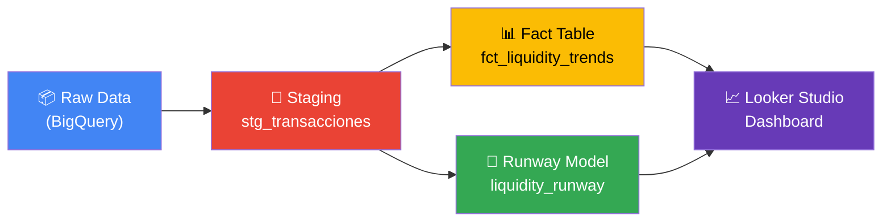
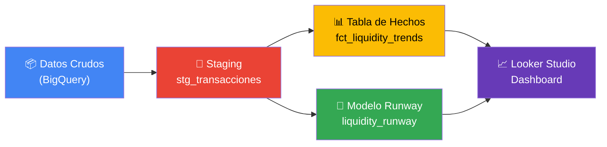

# 💰 WU Treasury — Liquidity Monitoring Pipeline

> 🌐 **[English](#-english)** | **[Español](#-español)**

---

## 🇺🇸 English

> **Automated cash flow analytics for a remittance network.**  
> Built with dbt + BigQuery + Looker Studio to monitor branch liquidity in real time and predict cash depletion.

### 📋 Business Problem

In a high-volume remittance network, **running out of cash at a branch means lost revenue and damaged customer trust.** Treasury teams need to answer critical questions every morning:

- *How fast is each branch consuming its available cash?*
- *How many hours of operations can each branch sustain?*
- *Which branches need emergency fund transfers?*

This project automates those answers by transforming raw transaction data into actionable treasury metrics using **dbt** on **Google BigQuery**, and visualizing them in a **Looker Studio** dashboard.

### 🏗️ Architecture



| Layer | Model | Purpose |
|---|---|---|
| **Source** | `transacciones_realistas` | Raw remittance transactions from Google Colab simulation |
| **Staging** | `stg_transacciones` | Data cleansing, type casting, column renaming |
| **Mart** | `fct_liquidity_trends` | Hourly withdrawal volumes + moving average burn rate per branch |
| **Mart** | `liquidity_runway` | Current liquidity position, alert status, and estimated depletion time |

### 📊 Dashboard

> 🔗 **[View Live Dashboard →](https://datastudio.google.com/reporting/cfc05396-c3ca-4ccc-b6d3-3ecd498994cc/page/rH1vF)**

The Looker Studio dashboard provides a real-time operational view for Treasury decision-making:

#### Key Performance Indicators

| KPI | Description |
|---|---|
| **Available Balance** | Total cash across all branches |
| **Burn Rate ($/hr)** | Average cash outflow velocity |
| **Liquidity Runway (hrs)** | Hours of operation sustainable with current funds |
| **Alert Status** | 🟢 Normal (>24h) · 🟡 Alert (6-24h) · 🔴 Critical (<6h) |

#### Dashboard Features
- **Branch Filter:** Drill down by specific branch (United States, Argentina, Brazil)
- **Dual-Axis Trend Chart:** Burn rate (bars) vs. Remaining liquidity hours (line)
- **Color-Coded Alerts:** Instant visual identification of branches at risk

### 🔑 Key Metrics Explained

#### Burn Rate
The 4-period moving average of hourly cash withdrawals per branch. Using a moving average instead of raw values **smooths out noise from transaction spikes**, giving Treasury a more reliable signal for decision-making.

```sql
AVG(total_retirado_usd) OVER (
    PARTITION BY sucursal_destino 
    ORDER BY hora_operacion 
    ROWS BETWEEN 3 PRECEDING AND CURRENT ROW
) AS velocidad_retiro_promedio_usd
```

#### Liquidity Runway
The estimated time until cash depletion:

```
Runway (hours) = Available Balance / Burn Rate
```

#### ETA Depletion
Projected timestamp when a branch will exhaust its cash reserves, enabling **proactive fund transfers** instead of reactive emergency responses.

### 🛠️ Tech Stack

| Tool | Purpose |
|---|---|
| **dbt** | Data transformation & modeling |
| **Google BigQuery** | Cloud data warehouse |
| **Looker Studio** | Business intelligence & visualization |
| **Google Colab** | Synthetic data generation |
| **Git + GitHub** | Version control |

### 🚀 Getting Started

```bash
# Clone the repository
git clone https://github.com/TabisiAugusto/wutreasury-project.git
cd wutreasury-project

# Install dbt
pip install dbt-bigquery

# Configure your connection (create profiles.yml in ~/.dbt/)
# Run the models
dbt run

# Run tests
dbt test

# Generate documentation
dbt docs generate && dbt docs serve
```

### 📁 Project Structure

```
wutreasury-project/
├── models/
│   ├── staging/
│   │   ├── stg_transacciones.sql      # Data cleansing & standardization
│   │   └── src_remesas.yml            # Source definitions & documentation
│   ├── fct_liquidity_trends.sql       # Historical burn rate analysis
│   └── liquidity_runway.sql           # Current liquidity position & alerts
├── dbt_project.yml                     # dbt configuration
├── .gitignore                          # Security: excludes credentials & data
└── README.md
```

### 🔒 Security

- ✅ `profiles.yml` excluded via `.gitignore` (contains BigQuery credentials)
- ✅ No API keys or service account files committed
- ✅ All `.json`, `.env`, and `.csv` files excluded from version control
- ✅ Synthetic data only — no real customer information

### 📈 Future Enhancements

- [ ] Add `dbt tests` for data quality validation
- [ ] Implement `dbt seeds` for branch reference data
- [ ] Add incremental materialization for scalability
- [ ] Seasonal forecasting (weekends, holidays, month-end peaks)
- [ ] Slack/email alerts when runway falls below threshold

---

## 🇦🇷 Español

> **Analítica automatizada de flujo de caja para una red de remesas.**  
> Construido con dbt + BigQuery + Looker Studio para monitorear la liquidez por sucursal en tiempo real y predecir el agotamiento de efectivo.

### 📋 Problema de Negocio

En una red de remesas de alto volumen, **quedarse sin efectivo en una sucursal significa pérdida de ingresos y daño a la confianza del cliente.** El equipo de Tesorería necesita responder preguntas críticas cada mañana:

- *¿Qué tan rápido consume efectivo cada sucursal?*
- *¿Cuántas horas de operación puede sostener cada sucursal?*
- *¿Qué sucursales necesitan transferencias de emergencia?*

Este proyecto automatiza esas respuestas transformando datos transaccionales crudos en métricas de tesorería accionables usando **dbt** sobre **Google BigQuery**, y visualizándolos en un dashboard de **Looker Studio**.

### 🏗️ Arquitectura



| Capa | Modelo | Propósito |
|---|---|---|
| **Fuente** | `transacciones_realistas` | Transacciones de remesas simuladas desde Google Colab |
| **Staging** | `stg_transacciones` | Limpieza de datos, casteo de tipos, renombrado de columnas |
| **Mart** | `fct_liquidity_trends` | Volúmenes de retiro por hora + burn rate con promedio móvil |
| **Mart** | `liquidity_runway` | Posición de liquidez actual, estado de alerta y hora estimada de agotamiento |

### 📊 Dashboard

> 🔗 **[Ver Dashboard Interactivo →](https://datastudio.google.com/reporting/cfc05396-c3ca-4ccc-b6d3-3ecd498994cc/page/rH1vF)**

El dashboard de Looker Studio provee una vista operativa en tiempo real para la toma de decisiones de Tesorería:

#### Indicadores Clave de Rendimiento (KPIs)

| KPI | Descripción |
|---|---|
| **Saldo Disponible** | Efectivo total disponible en todas las sucursales |
| **Burn Rate (USD/hr)** | Velocidad promedio de salida de efectivo |
| **Runway de Liquidez (hrs)** | Horas de operación sostenibles con los fondos actuales |
| **Estado de Alerta** | 🟢 Normal (>24h) · 🟡 Alerta (6-24h) · 🔴 Crítico (<6h) |

#### Funcionalidades del Dashboard
- **Filtro por Sucursal:** Detalle por sucursal específica (Estados Unidos, Argentina, Brasil)
- **Gráfico de Doble Eje:** Burn rate (barras) vs. Horas de liquidez restantes (línea)
- **Alertas por Color:** Identificación visual instantánea de sucursales en riesgo

### 🔑 Métricas Clave Explicadas

#### Burn Rate (Velocidad de Retiro)
Promedio móvil de 4 períodos de los retiros por hora por sucursal. Usar un promedio móvil en lugar de valores crudos **suaviza el ruido de picos transaccionales**, dando a Tesorería una señal más confiable.

```sql
AVG(total_retirado_usd) OVER (
    PARTITION BY sucursal_destino 
    ORDER BY hora_operacion 
    ROWS BETWEEN 3 PRECEDING AND CURRENT ROW
) AS velocidad_retiro_promedio_usd
```

#### Runway de Liquidez
Tiempo estimado hasta el agotamiento de efectivo:

```
Runway (horas) = Saldo Disponible / Burn Rate
```

#### ETA de Agotamiento
Timestamp proyectado en el que una sucursal agotaría su efectivo, permitiendo **transferencias proactivas** en lugar de respuestas de emergencia reactivas.

### 🛠️ Stack Tecnológico

| Herramienta | Uso |
|---|---|
| **dbt** | Transformación y modelado de datos |
| **Google BigQuery** | Data warehouse en la nube |
| **Looker Studio** | Inteligencia de negocio y visualización |
| **Google Colab** | Generación de datos sintéticos |
| **Git + GitHub** | Control de versiones |

### 🚀 Instalación

```bash
# Clonar el repositorio
git clone https://github.com/TabisiAugusto/wutreasury-project.git
cd wutreasury-project

# Instalar dbt
pip install dbt-bigquery

# Configurar la conexión (crear profiles.yml en ~/.dbt/)
# Ejecutar los modelos
dbt run

# Ejecutar tests
dbt test

# Generar documentación
dbt docs generate && dbt docs serve
```

### 🔒 Seguridad

- ✅ `profiles.yml` excluido vía `.gitignore` (contiene credenciales de BigQuery)
- ✅ Sin API keys ni archivos de service account en el repositorio
- ✅ Todos los archivos `.json`, `.env` y `.csv` excluidos del control de versiones
- ✅ Datos sintéticos únicamente — sin información real de clientes

### 📈 Mejoras Futuras

- [ ] Agregar `dbt tests` para validación de calidad de datos
- [ ] Implementar `dbt seeds` para datos de referencia de sucursales
- [ ] Agregar materialización incremental para escalabilidad
- [ ] Pronóstico estacional (fines de semana, feriados, cierre de mes)
- [ ] Alertas por Slack/email cuando el runway caiga debajo del umbral

---

## 👤 Author / Autor

**Augusto Tabisi**  
[GitHub](https://github.com/TabisiAugusto)

---

*Built as a Treasury Analytics case study demonstrating automated cash flow monitoring at scale.*  
*Construido como caso de estudio de Analytics de Tesorería, demostrando monitoreo automatizado de flujo de caja a escala.*
